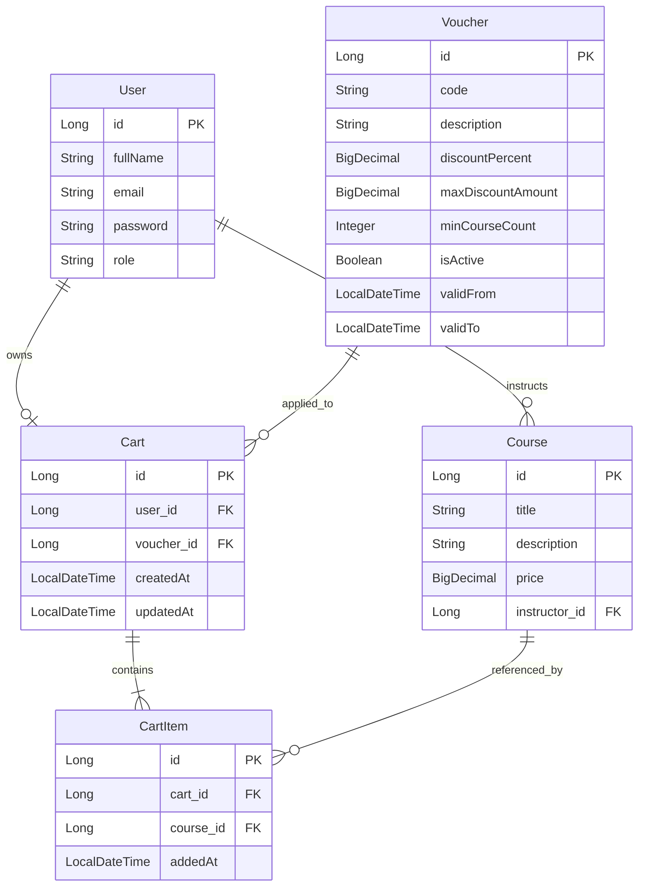

# Software Requirements Specification (SRS)
## Hệ thống E-Learning — Giỏ hàng & Mã giảm giá

**Phiên bản:** 1.0  
**Ngày:** 08/07/2026  
**Dự án:** IT212 Final Test — `elearning_base-main`

---

## 1. Tổng quan

Tài liệu này mô tả yêu cầu thiết kế cho tính năng **Giỏ hàng (Cart)** và **Mã giảm giá (Voucher)** trên nền tảng E-Learning hiện có. Phần phân tích dựa trên các Entity trong thư mục Base Code (`elearning_base-main/src/main/java/com/elearning/models/entities/`).

---

## 2. Phân tích Entity hiện có (Base Code)

### 2.1. User

| Thuộc tính   | Kiểu dữ liệu | Mô tả |
|-------------|--------------|-------|
| `id`        | `Long`       | Khóa chính, tự tăng (`GenerationType.IDENTITY`) |
| `fullName`  | `String`     | Họ và tên người dùng |
| `email`     | `String`     | Email đăng nhập |
| `password`  | `String`     | Mật khẩu (đã mã hóa khi lưu) |
| `role`      | `String`     | Vai trò: `STUDENT`, `INSTRUCTOR` |

**Quan hệ liên quan:** Một `User` (vai trò INSTRUCTOR) có thể sở hữu nhiều `Course` thông qua quan hệ `@ManyToOne` từ phía `Course`.

**Ghi chú:** Entity dùng JPA (`@Entity`, `@Table`), Lombok (`@Data`, `@NoArgsConstructor`, `@AllArgsConstructor`), bảng ánh xạ: `users`.

---

### 2.2. Course

| Thuộc tính      | Kiểu dữ liệu | Mô tả |
|----------------|--------------|-------|
| `id`           | `Long`       | Khóa chính, tự tăng |
| `title`        | `String`     | Tên khóa học |
| `description`  | `String`     | Mô tả khóa học |
| `instructor`   | `User`       | Giảng viên (`@ManyToOne`, FK: `instructor_id`) |

**Ghi chú:** Entity hiện **chưa có thuộc tính giá (`price`)**. Để triển khai giỏ hàng và tính tiền, cần **bổ sung** thuộc tính `price` (kiểu `BigDecimal`, đơn vị VNĐ) vào `Course`.

---

### 2.3. Kiến trúc kỹ thuật hiện tại

- **Framework:** Spring Boot 3.2.4, Java 17  
- **ORM:** Spring Data JPA + Hibernate  
- **CSDL:** MySQL (`elearning_base`)  
- **Bảo mật:** Spring Security + JWT  
- **API hiện có:** `/api/v1/courses` (GET danh sách khóa học), `/api/v1/auth` (đăng nhập/đăng ký)

---

## 3. Thiết kế Cấu trúc dữ liệu — Entity mới

### 3.1. Bổ sung Entity hiện có: Course (mở rộng)

| Thuộc tính mới | Kiểu dữ liệu  | Bắt buộc | Mô tả |
|---------------|---------------|----------|-------|
| `price`       | `BigDecimal`  | Có       | Giá bán khóa học (VNĐ), ví dụ: `1_500_000` |

---

### 3.2. Cart (Giỏ hàng)

Mỗi học viên (`STUDENT`) có **một giỏ hàng duy nhất** (hoặc một giỏ hàng đang hoạt động).

| Thuộc tính     | Kiểu dữ liệu   | Bắt buộc | Mô tả |
|---------------|----------------|----------|-------|
| `id`          | `Long`         | Có       | Khóa chính |
| `user`        | `User`         | Có       | Chủ sở hữu giỏ hàng (`@ManyToOne`, FK: `user_id`, unique) |
| `cartItems`   | `List<CartItem>` | Không  | Danh sách khóa học trong giỏ (`@OneToMany`, cascade) |
| `appliedVoucher` | `Voucher`   | Không    | Mã giảm giá đang áp dụng (`@ManyToOne`, FK: `voucher_id`) |
| `createdAt`   | `LocalDateTime`| Có       | Thời điểm tạo giỏ |
| `updatedAt`   | `LocalDateTime`| Có       | Thời điểm cập nhật gần nhất |

**Bảng ánh xạ:** `carts`  
**Ràng buộc:** Một `User` chỉ có tối đa một `Cart` (unique constraint trên `user_id`).

---

### 3.3. CartItem (Mục trong giỏ hàng)

| Thuộc tính   | Kiểu dữ liệu     | Bắt buộc | Mô tả |
|-------------|------------------|----------|-------|
| `id`        | `Long`             | Có       | Khóa chính |
| `cart`      | `Cart`             | Có       | Giỏ hàng chứa mục này (`@ManyToOne`, FK: `cart_id`) |
| `course`    | `Course`           | Có       | Khóa học được thêm (`@ManyToOne`, FK: `course_id`) |
| `addedAt`   | `LocalDateTime`    | Có       | Thời điểm thêm vào giỏ |

**Bảng ánh xạ:** `cart_items`  
**Ràng buộc:** Mỗi cặp `(cart_id, course_id)` là duy nhất — không thêm trùng cùng một khóa học vào giỏ.

**Ghi chú thiết kế:** Khóa học E-Learning thường mua theo đơn vị 1 khóa/lần, nên không cần trường `quantity`. Số lượng khóa học trong giỏ = `COUNT(cartItems)`.

---

### 3.4. Voucher (Mã giảm giá)

| Thuộc tính           | Kiểu dữ liệu   | Bắt buộc | Mô tả | Ví dụ |
|---------------------|----------------|----------|-------|-------|
| `id`                | `Long`         | Có       | Khóa chính | — |
| `code`              | `String`       | Có       | Mã voucher duy nhất, không phân biệt hoa thường khi nhập | `"SUMMER20"` |
| `description`       | `String`       | Không    | Mô tả ngắn cho người dùng | `"Giảm 20% mùa hè"` |
| `discountPercent`   | `BigDecimal`   | Có       | **Phần trăm giảm** (0–100) | `20` → giảm 20% |
| `maxDiscountAmount` | `BigDecimal`   | Có       | **Mức giảm tối đa** (VNĐ) — trần số tiền được giảm | `500_000` |
| `minCourseCount`    | `Integer`      | Có       | **Số lượng khóa học tối thiểu** trong giỏ để áp dụng | `2` |
| `isActive`          | `Boolean`      | Có       | Trạng thái kích hoạt | `true` |
| `validFrom`         | `LocalDateTime`| Không    | Thời điểm bắt đầu hiệu lực | — |
| `validTo`           | `LocalDateTime`| Không    | Thời điểm hết hiệu lực | — |

**Bảng ánh xạ:** `vouchers`  
**Ràng buộc:** `code` unique; `discountPercent` ∈ [0, 100]; `maxDiscountAmount` ≥ 0; `minCourseCount` ≥ 1.

---

### 3.5. Sơ đồ quan hệ Entity (ERD)



---

## 4. Đặc tả Thuật toán Tính tiền (Pricing Logic)

### 4.1. Đầu vào & Đầu ra

**Đầu vào:**
- `cart`: Giỏ hàng của người dùng (bao gồm danh sách `cartItems`, mỗi item liên kết tới `course.price`)
- `voucher` (tùy chọn): Mã giảm giá đã áp dụng hoặc `null`

**Đầu ra:**
- `subtotal`: Tổng tiền gốc (chưa giảm)
- `discountAmount`: Số tiền được giảm
- `finalAmount`: Số tiền cuối cùng phải trả
- `voucherApplied`: `true`/`false` — voucher có được áp dụng hay không
- `message`: Thông báo lý do (nếu voucher không áp dụng được)

---

### 4.2. Luồng logic tổng quát

```
┌─────────────────────────────────────────────────────────────┐
│  BƯỚC 1: Tính tổng tiền gốc (Subtotal)                      │
│  subtotal = SUM(course.price) cho mỗi cartItem trong cart   │
└──────────────────────────────┬──────────────────────────────┘
                               ▼
┌─────────────────────────────────────────────────────────────┐
│  BƯỚC 2: Đếm số khóa học trong giỏ                          │
│  courseCount = số phần tử trong cart.cartItems              │
└──────────────────────────────┬──────────────────────────────┘
                               ▼
                    ┌──────────┴──────────┐
                    │ voucher == null?    │
                    └──────────┬──────────┘
                          Có   │   Không
                    ┌──────────┴──────────┐
                    ▼                     ▼
         discountAmount = 0      BƯỚC 3: Kiểm tra điều kiện voucher
         finalAmount = subtotal            │
                                           ▼
                              ┌────────────────────────────┐
                              │ voucher.isActive == true?  │
                              │ voucher còn hiệu lực?      │
                              │ (validFrom ≤ now ≤ validTo)│
                              └────────────┬───────────────┘
                                      Không │ Có
                              ┌─────────────┴─────────────┐
                              ▼                           ▼
                   discountAmount = 0          BƯỚC 4: Kiểm tra số lượng
                   voucherApplied = false              khóa học tối thiểu
                   message = "Voucher không hợp lệ"              │
                                                                 ▼
                                              courseCount >= voucher.minCourseCount ?
                                                      Không │ Có
                                              ┌─────────────┴─────────────┐
                                              ▼                           ▼
                                   discountAmount = 0          BƯỚC 5: Tính % giảm
                                   voucherApplied = false              │
                                   message = "Cần tối thiểu              ▼
                                   {minCourseCount} khóa học"   rawDiscount =
                                                                 subtotal × discountPercent / 100
                                                                           │
                                                                           ▼
                                                              BƯỚC 6: Chặn trần mức giảm tối đa
                                                              discountAmount =
                                                                 MIN(rawDiscount, maxDiscountAmount)
                                                                           │
                                                                           ▼
                                                              BƯỚC 7: Tính số tiền cuối
                                                              finalAmount = subtotal - discountAmount
                                                              voucherApplied = true
```

---

### 4.3. Pseudo-code

```
FUNCTION calculateCartTotal(cart, voucher):
    // --- Bước 1: Tính subtotal ---
    subtotal = 0
    FOR EACH item IN cart.cartItems:
        subtotal = subtotal + item.course.price
    END FOR

    // --- Bước 2: Đếm số khóa học ---
    courseCount = cart.cartItems.size()

    // Khởi tạo kết quả mặc định (không có voucher)
    discountAmount = 0
    voucherApplied = false
    message = ""

    IF voucher IS NULL:
        finalAmount = subtotal
        RETURN { subtotal, discountAmount, finalAmount, voucherApplied, message }

    // --- Bước 3: Kiểm tra voucher hợp lệ ---
    now = CURRENT_DATETIME()

    IF voucher.isActive == FALSE:
        finalAmount = subtotal
        message = "Mã giảm giá không còn hoạt động"
        RETURN { subtotal, discountAmount, finalAmount, voucherApplied, message }

    IF voucher.validFrom IS NOT NULL AND now < voucher.validFrom:
        finalAmount = subtotal
        message = "Mã giảm giá chưa có hiệu lực"
        RETURN { subtotal, discountAmount, finalAmount, voucherApplied, message }

    IF voucher.validTo IS NOT NULL AND now > voucher.validTo:
        finalAmount = subtotal
        message = "Mã giảm giá đã hết hạn"
        RETURN { subtotal, discountAmount, finalAmount, voucherApplied, message }

    // --- Bước 4: Kiểm tra số lượng khóa học tối thiểu ---
    IF courseCount < voucher.minCourseCount:
        finalAmount = subtotal
        message = "Cần tối thiểu " + voucher.minCourseCount + " khóa học để áp dụng mã này"
        RETURN { subtotal, discountAmount, finalAmount, voucherApplied, message }

    // --- Bước 5: Tính số tiền giảm theo phần trăm ---
    rawDiscount = subtotal × (voucher.discountPercent / 100)

    // --- Bước 6: Chặn trần mức giảm tối đa ---
    discountAmount = MIN(rawDiscount, voucher.maxDiscountAmount)

    // --- Bước 7: Tính số tiền cuối cùng ---
    finalAmount = subtotal - discountAmount
    voucherApplied = TRUE
    message = "Áp dụng mã " + voucher.code + " thành công"

    RETURN { subtotal, discountAmount, finalAmount, voucherApplied, message }
END FUNCTION
```

---

### 4.4. Ví dụ minh họa

**Giả sử voucher:** `SUMMER20` — giảm **20%**, tối đa **500.000 VNĐ**, tối thiểu **2 khóa học**.

| Kịch bản | Khóa học trong giỏ | Subtotal | courseCount | rawDiscount (20%) | discountAmount (sau trần) | finalAmount |
|----------|-------------------|----------|-------------|-------------------|---------------------------|-------------|
| A | 1 khóa × 1.000.000 | 1.000.000 | 1 | — | 0 (chưa đủ 2 khóa) | **1.000.000** |
| B | 2 khóa × 1.000.000 | 2.000.000 | 2 | 400.000 | 400.000 | **1.600.000** |
| C | 3 khóa × 2.000.000 | 6.000.000 | 3 | 1.200.000 | **500.000** (bị chặn trần) | **5.500.000** |
| D | Không có voucher, 2 khóa × 800.000 | 1.600.000 | 2 | — | 0 | **1.600.000** |

**Giải thích kịch bản C:**  
`rawDiscount = 6.000.000 × 20% = 1.200.000`, nhưng `maxDiscountAmount = 500.000` → `discountAmount = MIN(1.200.000, 500.000) = 500.000`.

---

## 5. Yêu cầu phi chức năng liên quan

| STT | Yêu cầu |
|-----|---------|
| 1 | Sử dụng `BigDecimal` cho mọi phép tính tiền tệ, tránh sai số làm tròn của `double`/`float`. |
| 2 | Làm tròn kết quả tiền tệ theo quy tắc HALF_UP, 0 chữ số thập phân (VNĐ). |
| 3 | Chỉ học viên (`role = STUDENT`) được thao tác giỏ hàng của chính mình. |
| 4 | API trả về cấu trúc `ApiResponse<T>` thống nhất với Base Code hiện tại. |
| 5 | Ném `BusinessException` khi voucher không tồn tại hoặc mã không hợp lệ (theo pattern exception hiện có). |

---

## 6. Phạm vi API đề xuất (tham khảo triển khai)

| Method | Endpoint | Mô tả |
|--------|----------|-------|
| GET | `/api/v1/cart` | Xem giỏ hàng & tổng tiền |
| POST | `/api/v1/cart/items` | Thêm khóa học vào giỏ |
| DELETE | `/api/v1/cart/items/{courseId}` | Xóa khóa học khỏi giỏ |
| POST | `/api/v1/cart/voucher` | Áp dụng mã giảm giá |
| DELETE | `/api/v1/cart/voucher` | Gỡ mã giảm giá |

---

*Tài liệu SRS này là cơ sở để triển khai các Entity, Repository, Service và Controller cho module Giỏ hàng & Voucher trên nền Base Code E-Learning.*
